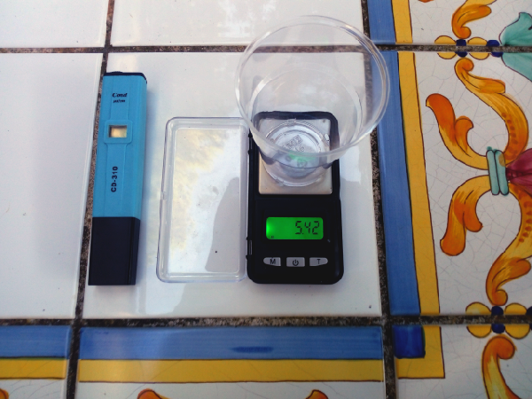
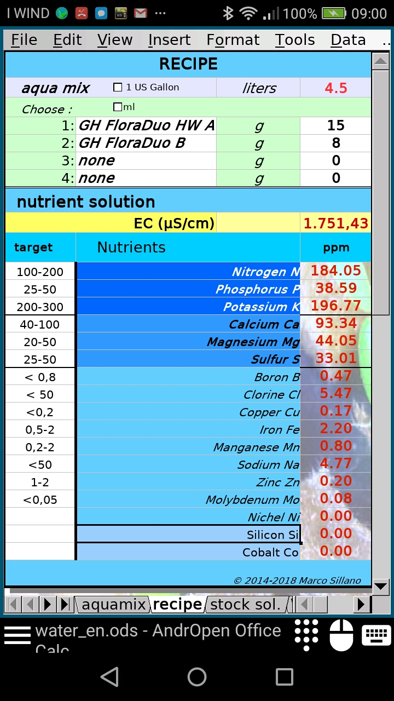

# MyHydroponics

----------
## solution calculators
 - **EC dilutions calculator** for PC and smartphone. https://github.com/msillano/MyHydroponics/tree/master/EC_dilutions
  

- **Nutritive solutions calculators:** 
     -- water mix calculator
     --  recipe calculator
     --  mother solution calculator
     
 General purpose, plus notes on Phalaenopsis hydroponic cultivation.
 
 For PC and smartphone https://github.com/msillano/MyHydroponics/tree/master/recipes
 
 

--------
## complete DIY projects
 - **Ebb and Flow** for Orchids https://github.com/msillano/Sonoff-ebb-and-flow 
 
 
 - **Idroponica verticale** https://github.com/msillano/vertical_hydroponics (only Italian version)
 
 
